# Gastro Gnome

Gastro Gnome is an application intended for the true _gastronomes_ where users can discover, collect, and share their favorite recipes using an intuitive and user friendly platform. The application is built with full CRUD functionality, makes use of React hooks to manage application state, and interfaces with a third party API to display a nutrition profile for each recipe.

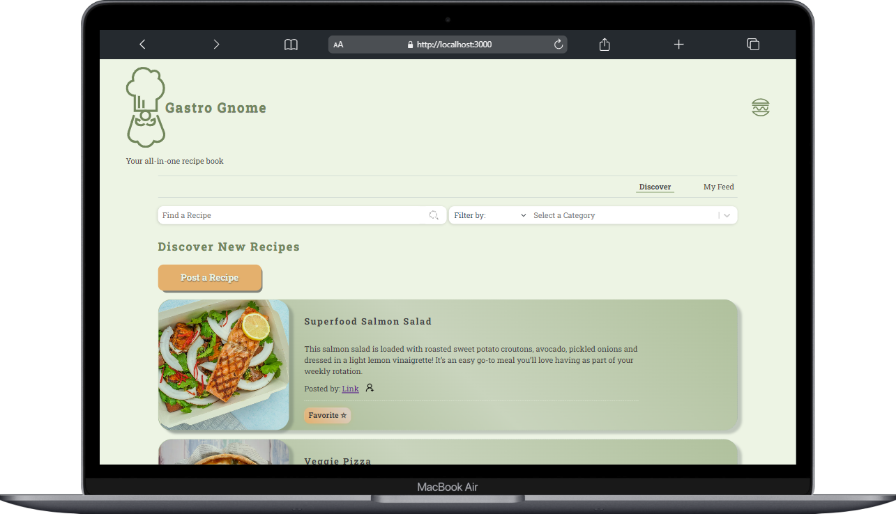

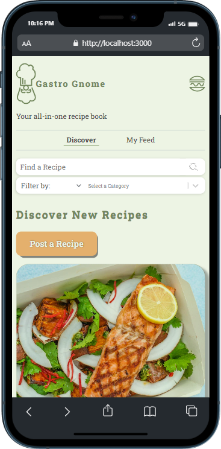

## Primary Features
Users can:
 - Add recipes to their "favorites"
 - Follow users they want to keep track of
 - Toggle between viewing all recipes or viewing only recipes from    people they follow
 - Search for recipes and authors by name
 - Filter recipes by over 100 options to choose from
 - View their own posts, their favorite posts, users they follow, and  users following them on their profile
 - Automatically view the nutritional content of any recipe posted on the application via a 3rd party API.

 ## Installations and Getting Started

1.  Install dependencies for React in the gastro-gnome directory:

    ```bash
    npm install
    ```

2.  Next, pull down the repository for the server

    ```bash
    git clone git@github.com:ryanmphill/gastro-gnome-api.git
    ```

3.  This project uses **json-server** as a mock REST API for the client to interact with. Prior to using json-server, you will need to verify that Node.js and npm are installed and up to date on your system. Then, in the gastro-gnome-api directory run this command:

    ```bash
    npm install json-server
    ```

    The client will be making requests to port 8088. Verify that the mock server starts up by running this command:

    ```bash
    npx json-server database.json -p 8088
    ```
    _If json-server is already installed globally on your system, simply run:_
    ```bash
    json-server database.json -p 8088
    ```
4.  Now you can start up the Gastro Gnome Client by running this command in the gastro-gnome project directory:

    ```bash
    npm start
    ```

5.  To sign into the application, simply type in one of the following fake user email addresses:

    - fbaggins@shire.net
    - swisegamgee@shire.net
    - gimli@thorinscompany.com
    - gdalf0@middleearthstate.edu

6.  Now you're ready to browse around Gastro Gnome!

#### Having trouble getting started?
Please reach out to me or open an issue, and I will try to resolve it ASAP.

## Main Recipe Feed

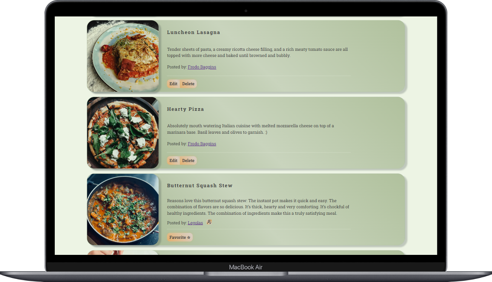

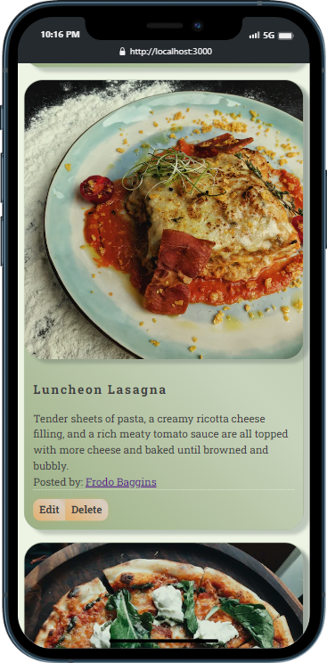

## Recipe

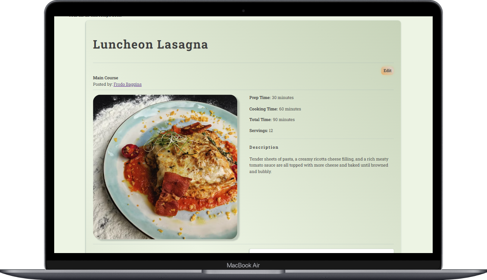

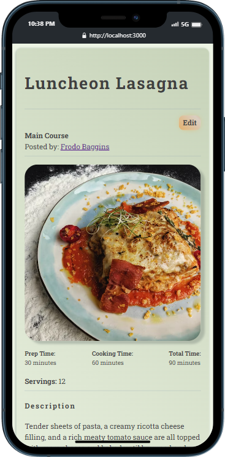

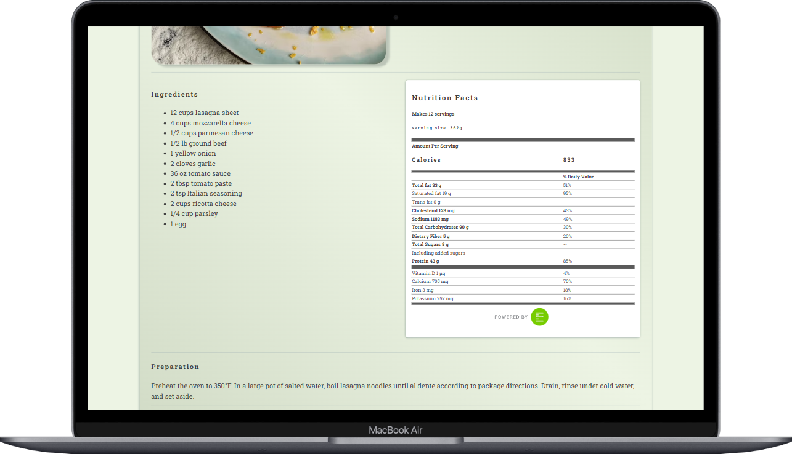

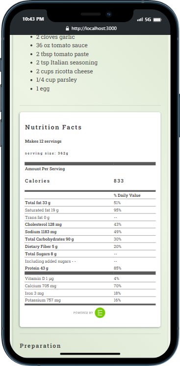

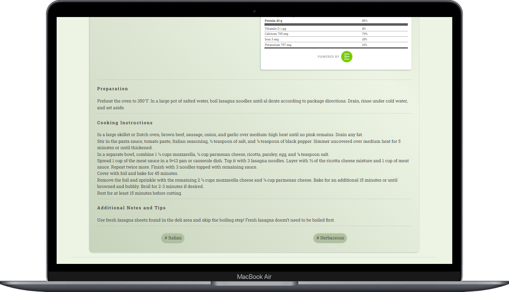

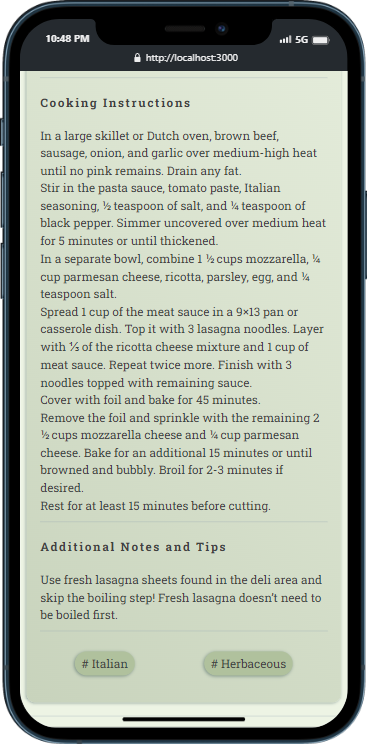

## User Profile

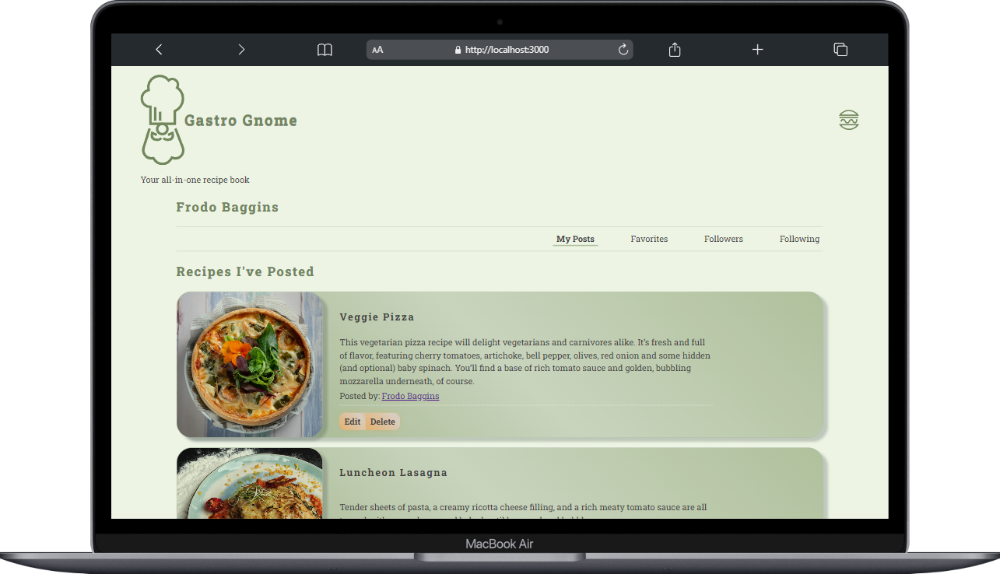

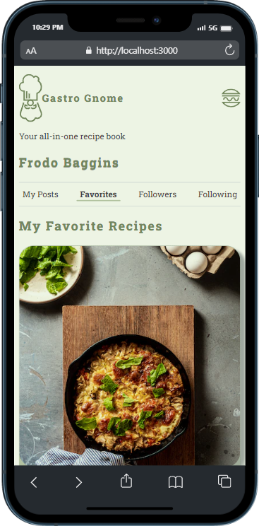